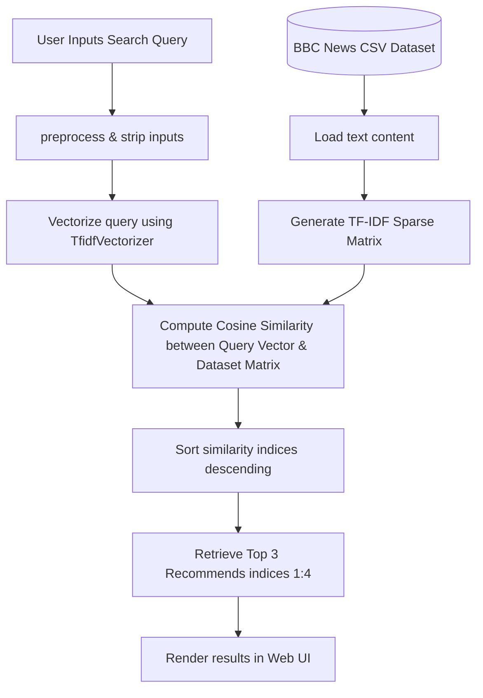

# News Recommendation System

An elegant, lightweight, and high-performance **Content-Based News Recommendation System**. This application uses natural language processing (NLP) to recommend news articles matching a user's query or interest. It is built with a **Flask** web framework and uses **scikit-learn**'s TF-IDF vectorization and cosine similarity calculations.

---

## 📂 Project Structure

Here is a view of the project's layout:

```text
├── data/
│   └── bbc_news_dataset.csv          # Dataset containing BBC news articles (1490 articles)
├── notebooks/
│   └── news_recommendation.ipynb     # Jupyter Notebook detailing exploratory data analysis and algorithm testing
├── src/
│   ├── app.py                        # Web application entry point (Flask server)
│   ├── recommend.py                  # Core recommendation engine (TF-IDF & Cosine Similarity)
│   ├── static/
│   │   └── style.css                 # Custom CSS stylesheet for the frontend UI
│   └── templates/
│       └── index.html                # Jinja2 template file for the web UI page
├── pyproject.toml                    # Project configuration and dependency listing
├── uv.lock                           # Locked dependency versions
└── README.md                         # Project documentation (this file)
```

---

## ⚙️ How It Works (Technical Approach)

The application employs a **Content-Based Filtering** approach using standard text-vectorization techniques:



### 1. TF-IDF (Term Frequency-Inverse Document Frequency)
Text data cannot be read directly by machine learning algorithms. We use `TfidfVectorizer` to translate document text into a numerical matrix:
* **Term Frequency (TF)**: Evaluates how frequently a term appears in a document.
* **Inverse Document Frequency (IDF)**: Scales down words that appear very frequently across all documents (e.g., "the", "news", "and") while scaling up rare terms that contain higher semantic value.
* **Stop Words**: Common English stop words are filtered out to improve feature representation and performance.

### 2. Cosine Similarity
To find articles similar to a user query, we project both the user query and the news articles into the same vector space. We then compute the cosine of the angle between the query vector $q$ and each document vector $d$:

$$\text{Cosine Similarity}(q, d) = \frac{q \cdot d}{\|q\| \|d\|}$$

A score closer to $1.0$ indicates high semantic overlap, while $0.0$ represents no common vocabulary elements.

### 3. Recommendation Selection
* In [`src/recommend.py`](src/recommend.py), the similarity scores are sorted in descending order.
* The system retrieves `similarity.argsort()[0][::-1][1:4]`, which returns the top 2nd, 3rd, and 4th matches (skipping index 0). 
* *Note on Design Choice*: Index 0 is skipped because if a user inputs a query that matches an existing article text exactly (or closely), index 0 would simply return that exact same article. Skipping the first index yields the next 3 most similar but *different* articles.

---

## 📊 Dataset Profile

The model runs on the **BBC News Dataset** (`data/bbc_news_dataset.csv`):
* **Size**: 1,490 rows
* **Features**:
  * `ArticleId`: Unique identifier for each article.
  * `Text`: The full raw text of the news article.
  * `Category`: The labeled genre of the article (e.g., *business, tech, politics, entertainment, sport*).

---

## 🚀 Installation & Local Run Guide

This project is configured to use the modern, fast package manager **`uv`**. Follow these instructions to set up the environment and run the system.

### Prerequisites
- Python $\ge$ 3.12
- `uv` (recommended) or standard `pip`

### Method 1: Running with `uv` (Fastest)

1. **Install dependencies and create virtual environment**:
   ```bash
   uv sync
   ```
2. **Start the Flask server**:
   ```bash
   uv run src/app.py
   ```
3. Open your browser and navigate to `http://127.0.0.1:5000`.

### Method 2: Running with standard Python virtual environment

1. **Create and activate a virtual environment**:
   ```bash
   python -m venv .venv
   source .venv/bin/activate  # On Windows: .venv\Scripts\activate
   ```
2. **Install the dependencies**:
   ```bash
   pip install flask numpy pandas scikit-learn
   ```
3. **Start the Flask server**:
   ```bash
   python src/app.py
   ```
4. Navigate to `http://127.0.0.1:5000` in your web browser.

---

## 💻 Code Reference

### Core Recommendation: `src/recommend.py`
The recommendation engine loads the dataset, vectorizes the articles, computes similarity against the user query, and returns the top 3 recommendations.


### Flask Server: `src/app.py`
App handles the home route and forms validation:
- Cleans and strips inputs.
- Validates query lengths (must be $\ge$ 5 characters).
- Passes the query to the recommendation engine.

---

## 🎨 User Interface & Styling

The frontend web UI is styled dynamically using a clean and responsive containerized layout:
- **Clean Focus States**: Visual cues when typing queries.
- **Validation Messages**: Shows errors if the query is empty or too short.
- **Readable Layout**: Structured article card representations highlighting recommendations.
